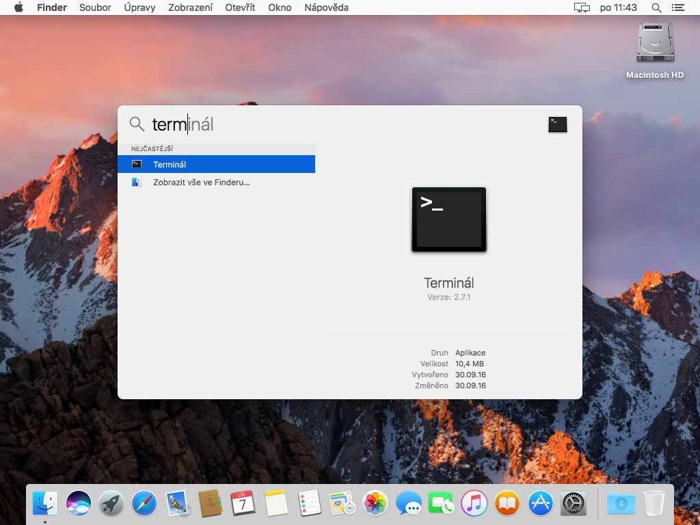
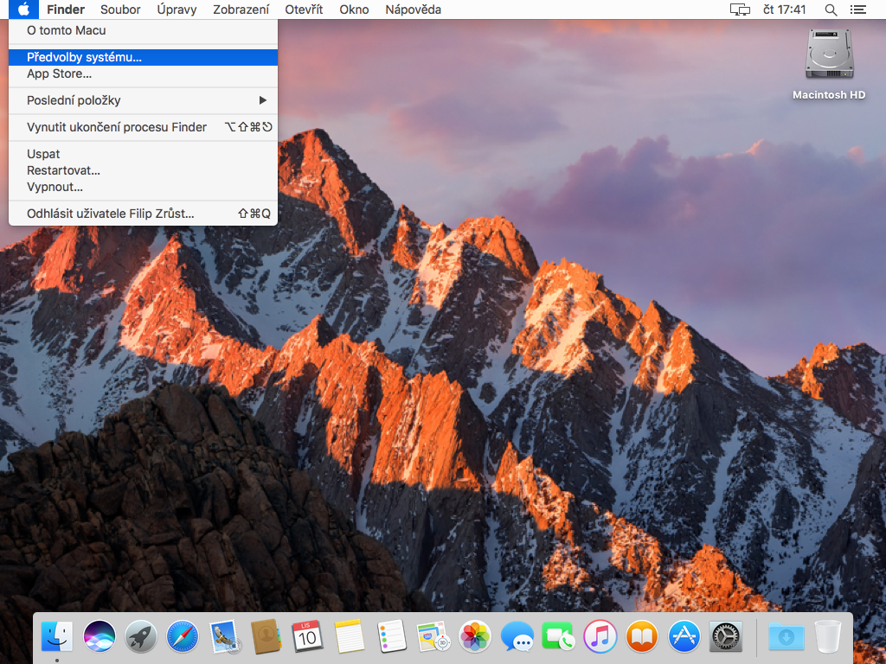
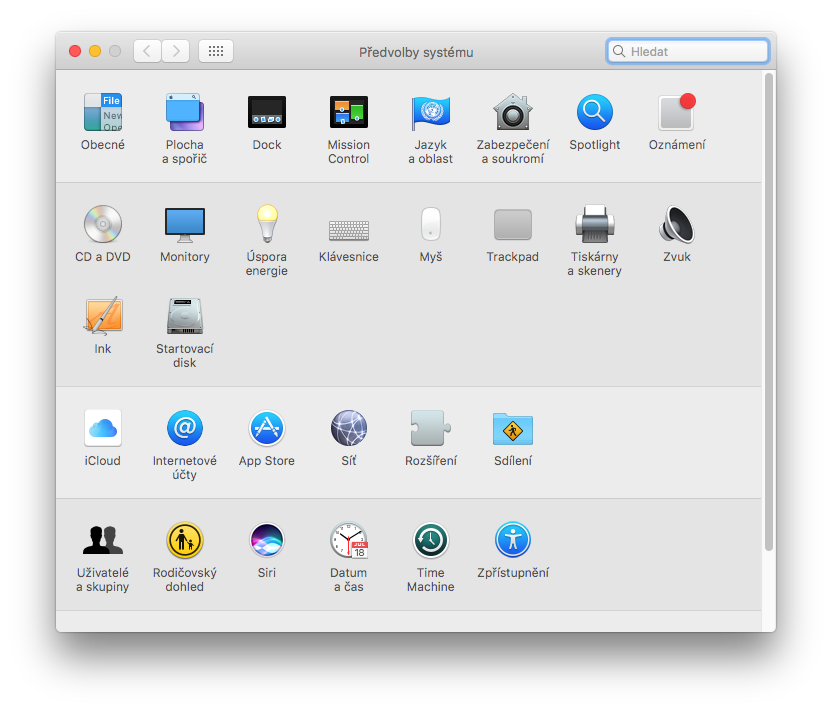
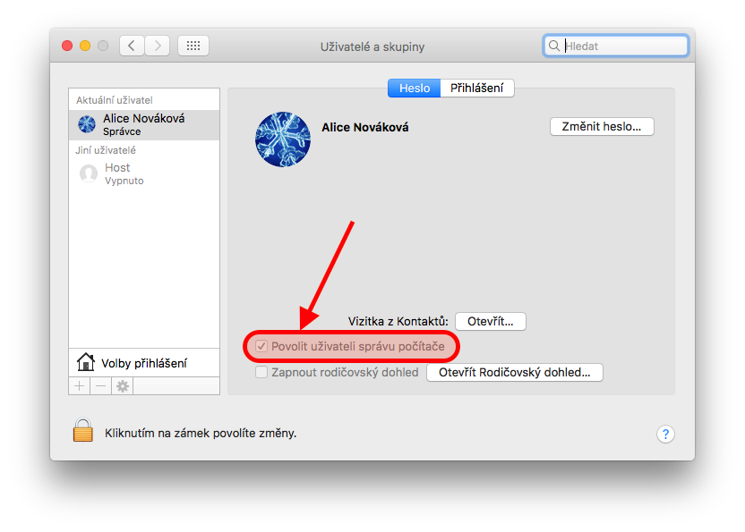
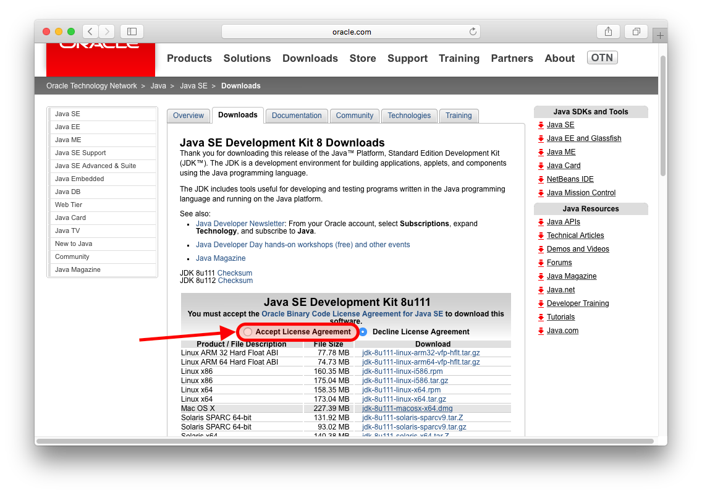
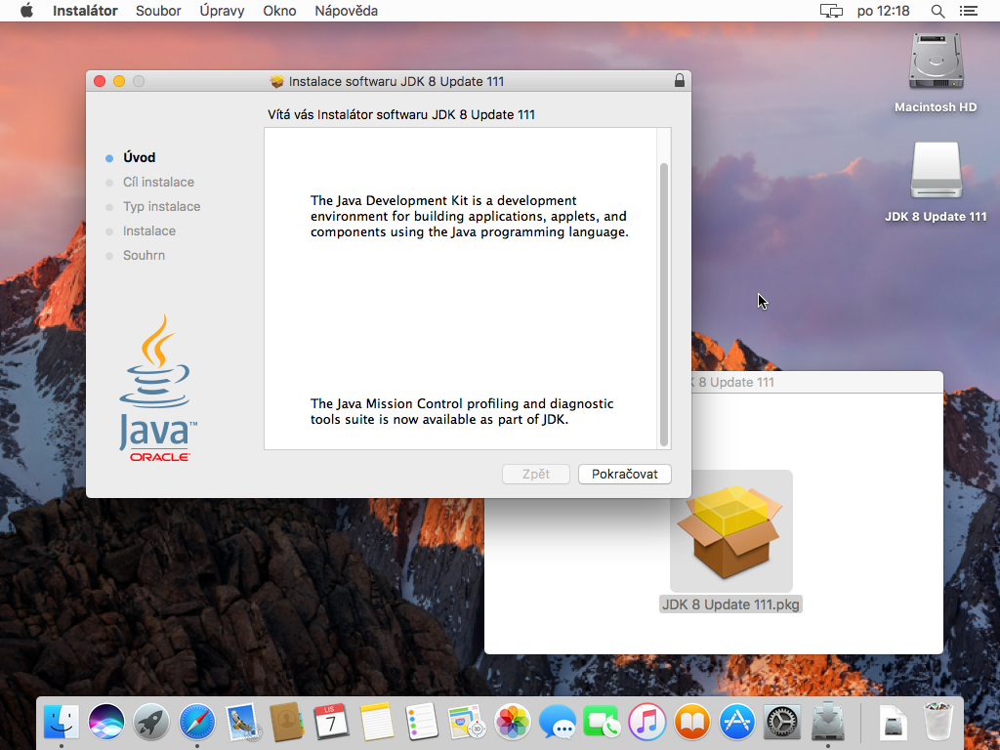
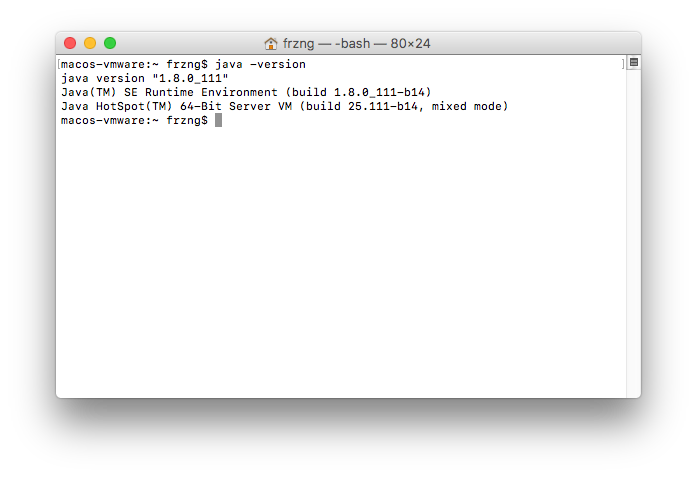
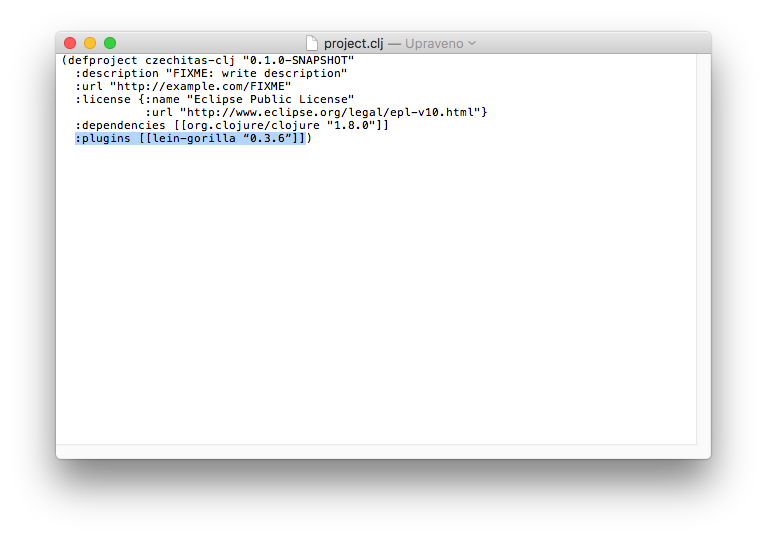
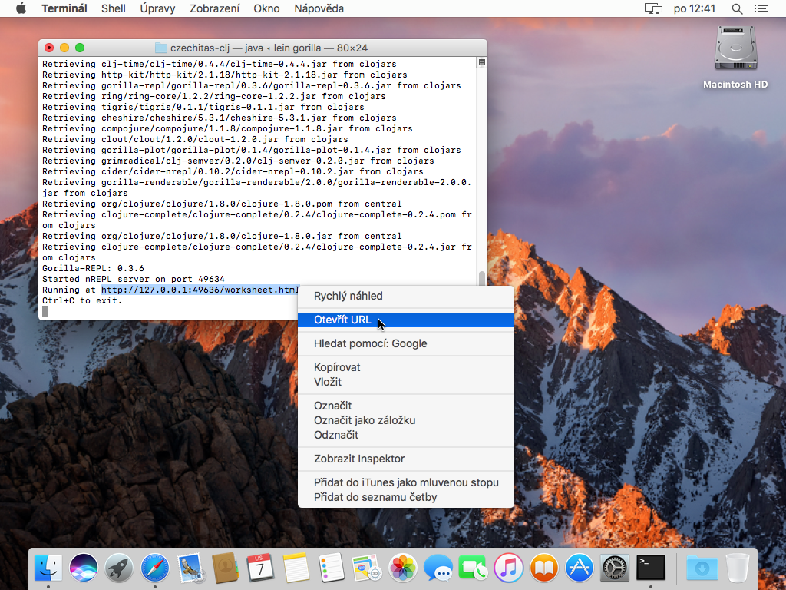
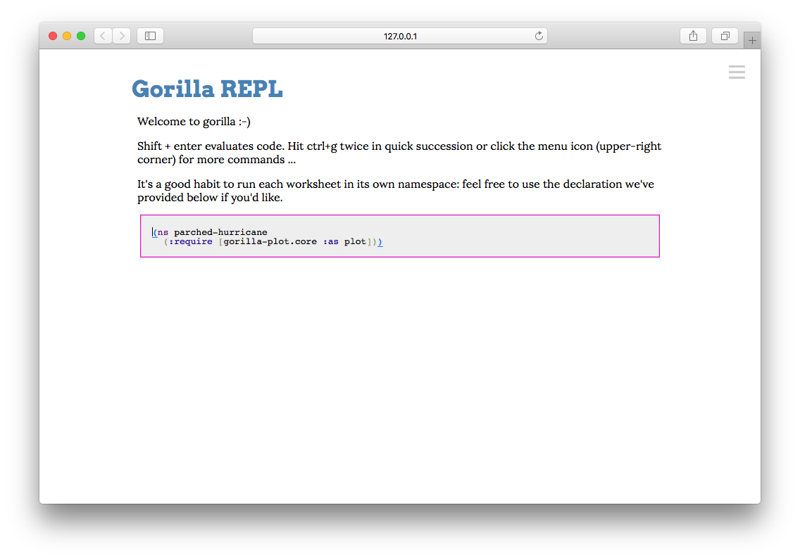

# Nastavení macOS 10.12

## Cílový stav

Po dokončení všech kroků nastavení bychom měli získat systém, na kterém bude následující software, abychom mohli psát kód v Clojure.

- [Java](https://java.com/): virtuální stroj, nad kterým Clojure běží a je tady absolutní nezbytností.
- [Leiningen](https://leiningen.org/): nástroj pro správu Clojure projektů, který je de facto nezbytností pro jakýkoli vývoj v Clojure. Zároveň instaluje samotný Clojure.
- [Gorilla REPL](http://gorilla-repl.org/index.html): prostředí pro spouštění, experimentování, rychlou zpětnou vazbu a sdílení Clojure kódu.


## Terminál a oprávnění

Při instalaci budeme používat *Terminál*, někdy také označovaný jako příkazová řádka. Jedná se o standardní součást macOS.

Terminál lze například spustit přes *Spotlight*. Ten se aktivuje kliknutím na symbol lupy v pravém horním rohu obrazovky. Do Spotlightu potom stačí napsat několik prvních písmen jako například `term` a jistě se nám aplikace Terminál ukáže. Pustíme ji dvojklikem nebo stiskem Enter, když je zvýrazněna.



Některé úkony vyžadují vyšší uživatelské oprávnění a je potřeba mít typ účet správce. Pokud je v systému pouze jeden uživatelský účet, tak se téměř jistě jedná o správce.

Jestli používáme typ účtu správce zjistíme tak, že si otevřeme *Předvolby systému* z horního Apple menu.



Zde po spuštění vybere ze spodní kategorie položku *Uživatelé a skupiny*.



Jestli máme správcovský účet nebo ne se potom dozvíme ve spodní části informací o našem účtu.



Základy práce s terminálem nebo nastavení uživatelských účtů jsou nad rámec této příručky.

## Instalace Javy

Stáhneme si [Java JDK z webu Oracle](http://www.oracle.com/technetwork/java/javase/downloads/jdk8-downloads-2133151.html).



Stránka pro stažení nabízí spoustu možností. Pro nás je nejlepší stáhnout hned první z nabízených balíků nadepsaný *Java SE Development Kit* s číslem verze. Před stažením je potřeba souhlasit s licenčními podmínkami, což se provede vybráním volby hned pod výše zmíněným nadpisem. Pak už můžeme stáhnout instalátor s popisem *Mac OS X* (historické označení pro macOS).

Po stažení Javu nainstalujeme klasickým postupem pro instalaci software staženého z internetu. Stažený DMG soubor dvojklikem „připojíme“. Spustíme instalátor a krok po kroku dojdeme až na konec instalačního procesu. Během toho budeme dotázáni na naše heslo pro potvrzení a autorizování změn v systému. DMG soubor „vysuneme“ např. přetažením z Plochy do Koše. Poté můžeme ho případně smazat, pokud jsme tak nevybrali na konci instalace, např. přetažením ze složky Stahování do Koše.



Na konec celé instalační procedury ověříme, že máme Javu nainstalovanou a že je dostupná. Otevřeme si Terminál (viz. výše) a zadáme následující příkaz:

```bash
java -version
```

Výsledkem by měl být podobný výpis s tím, že konkrétní čísla verze Javy se mohou mírně lišit.




## Instalace Leiningenu

Dále budeme pracovat s Terminálem. Pokud ho máte otevřený z instalace Javy, můžete bez problémů pokračovat.

**Poznámka**: Pokud náhodou máte nainstalovaný správce balíčků [Homebrew](http://brew.sh), Leiningen lze instalovat příkazem `brew install leiningen`. Poté je možné přejít rovnou k instalaci Gorilla REPL níže.

Nejprve si vytvoříme adresář, kde budeme mít pomocné programy pro programování jako je právě Leiningen:

```bash
sudo mkdir -p /usr/local/bin
```

Protože se jedná o nový systémový adresář, musíme zadat naše heslo pro autorizování a potvrzení této změny. Systém si po krátkou dobu bude heslo pamatovat, takže bychom tím už neměli být obtěžováni.

Nyní stáhneme skript `lein`. který uložíme do souboru v právě vytvořeném adresáři:

```bash
curl -fsSLO https://raw.githubusercontent.com/technomancy/leiningen/stable/bin/lein && sudo mv lein /usr/local/bin
```

Poté změníme práva k souboru `lein` tak, aby šel spouštět:

```bash
sudo chmod a+x /usr/local/bin/lein
```

Nakonec instalaci dokončíme spuštěním staženého skriptu:

```bash
lein
```

Leiningen doinstaluje další nutné soubory a následně zobrazí nápovědu, jak se s ním pracuje.


## Vytvoření projektu s Gorilla REPL

Dále budeme pracovat s Terminálem. Pokud ho máte otevřený z instalace Leiningenu, můžete bez problémů pokračovat.

Prostředí Gorilla REPLu se spouští v rámci projektu, proto takový projekt musíme vytvořit.

Nejprve si ale vytvoříme nový adresář pro vývoj software obecně. V zásadě ale není problém vše provádět přímo v domovském adresáři nebo například ve složce *Dokumenty*. Zde ale budu vytvářet nový adresář *Developer* v domovské složce:

```bash
mkdir ~/Developer
```

Přesuneme se do vybraného adresáře, kde budeme vytvářet projekt s Gorilla REPLem. V mém případě se jedná o výše vytvořený adresář *Developer*.

```bash
cd ~/Developer
```

Založíme nový projekt přes Leiningen:

```bash
lein new czechitas-clj
```

Přesuneme se do adresáře s nově vytvořeným projektem:

```bash
cd czechitas-clj
```

Otevřeme si *project.clj* tak, abychom mohli upravit konfiguraci projektu.

```bash
open -e project.clj
```

Soubor *project.clj* už je vlastně kód v programovacím jazyce Clojure, proto může působit na první pohled trochu divně a nepřehledně. Je tak potřeba dávat pozor, co děláme.

Nejlepší je najít poslední závorku v souboru. Před ní umístíme kurzor, odřádkujeme Enterem, odsadíme dvěma mezerami a vložíme konfiguraci pro Leiningen pluginy s Gorilla REPLem: `:plugins [[lein-gorilla "0.3.6"]]`. 



Pozor na záměnu za inteligentní uvozovky. Funkci je nejlépe dočasně vypnout a vkládat daný text přes Kopírovat/Vložit resp. Cmd+C/Cmd+V. Zda je záměna  za inteligentní uvozovky aktivní zjistíte otevřením menu *Úpravy*, aktivací položky *Záměny* a zkontrolováním podpoložky *Inteligentní uvozovky*, kde tuto funkci můžete dočasně vypnout.


Po úpravě editor *TextEdit* zavřeme.

Poté se vrátíme zpět k Terminálu a spustíme Gorilla REPL:

```bash
lein gorilla
```

 Začnou se doinstalovávat závislosti a samotný Gorilla REPL. Nakonec se ale spustí a na předposledním řádku bude vypsána adresa, kde běží. Na adrese vyvoláme kontextové menu (Ctrl+klik nebo klik dvěma prsty) a vybereme *Otevřít URL*.
 


Po načtení se nám zobrazí Gorilla REPL.



Skvělé 🙌 Přípravu počítače na workshop máme hotovu! 💪