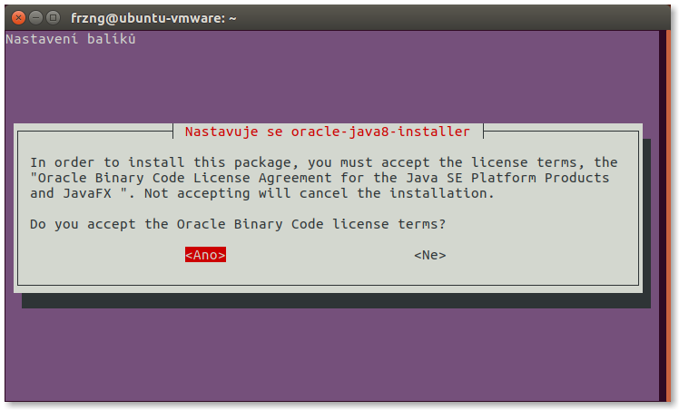
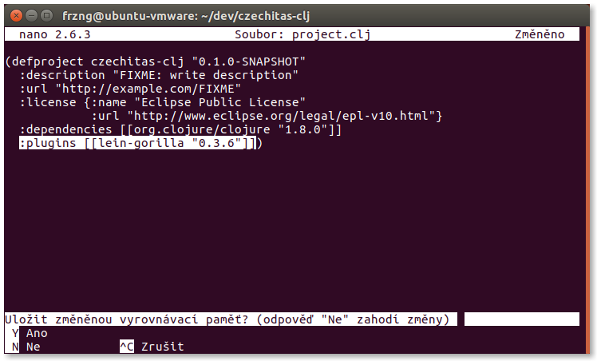

# Nastavení Ubuntu 16.10

## Cílový stav

Po dokončení všech kroků nastavení bychom měli získat systém, na kterém bude následující software, abychom mohli psát kód v Clojure.

- [Java](https://java.com/): virtuální stroj, nad kterým Clojure běží a je tady absolutní nezbytností.
- [Leiningen](https://leiningen.org/): nástroj pro správu Clojure projektů, který je de facto nezbytností pro jakýkoli vývoj v Clojure. Zároveň instaluje samotný Clojure.
- [Gorilla REPL](http://gorilla-repl.org/index.html): prostředí pro spouštění, experimentování, rychlou zpětnou vazbu a sdílení Clojure kódu.


## Terminál a oprávnění

Při instalaci budeme používat terminál, někdy také označovaný jako příkazová řádka. Terminál je standardní součástí desktopové verze Ubuntu.


Některé úkony vyžadují vyšší oprávnění a je na potřeba mít typ účet správce. Pokud je v systému pouze jeden uživatelský účet, tak se téměř jistě jedná o správce.


Základy práce s terminálem jsou nad rámec této příručky.

## Instalace Javy

Java je složitý ekosystém, do kterého nyní nemusíme zcela vstupovat. Bohužel jedna z komplexností je hned v tom, že existuje více implementací a distribucí Javy. Ubuntu, jako spousta jiných distribucí Linuxu, doporučuje používat OpenJDK, která není zatížena proprietární licencí. Nicméně s OpenJDK občas bývají problémy, proto je lepší zvolit referenční implementaci přímo od Oracle. Její nevýhodou ale je, že nevyhovuje definici svobodného nebo open source software.

Nejprve si přidáme repositář se softwarem od týmu Web Upd8, který spravuje instalátor Javy od Oracle pro Ubuntu:

```bash
sudo add-apt-repository ppa:webupd8team/java
```

Během procesu budeme požádáni o heslo pro ověření toho, že příkaz vykonáme jako správce. To je nutné, protože se jedná o změnu systému. Poté jsme seznámeni s účelem Java repositáře od Web Upd8, což je nutné potvrdit stiskem klávesy Enter, jak se píše v závěru. Po potvrzení je přidání repositáře dokončeno.

Dále aktualizujeme seznam software, který máme k dispozici:

```bash
sudo apt-get update
```

Nakonec spustíme instalaci Javy:

```
sudo apt-get install oracle-java8-installer
```

V úvodu jsme seznámeni s tím, že použití Javy od Oracle podléhá licenčním podmínkám, které je možné si přečíst na uváděné webové adrese. To nezbývá než potvrdit stiskem Enter.

Poté jsme vyzváni k souhlasu s těmito podmínkami. Klávesou Tab vybíráme možnost. Klávesou Enter potvrzujeme vybranou možnost jako odpověď na výzvu.



Následně se začne instalovat Java.

Na konec celé instalační procedury ověříme, že máme Javu od Oracle nainstalovanou a že je aktivní:

```bash
java -version
```

Výsledkem by měl být podobný výpis s tím, že konkrétní čísla verze Javy se mohou mírně lišit.


## Instalace Leiningenu

Oproti Javě je Leiningen malý kousek software a o to je situace snazší a přehlednější. Pro instalaci nebudeme používat balíčky z repositářů a nebudeme měnit základní systém.

Nejprve je potřeba vytvořit adresář, kde budeme mít spustitelné soubory. Právě takovým souborem potom budeme Leiningen, respektive náš Clojure projekt, ovládat.

```bash
mkdir ~/bin
```

Nyní stáhneme skript `lein`, který uložíme do souboru v právě vytvořeném adresáři:

```bash
curl -fsSL https://raw.githubusercontent.com/technomancy/leiningen/stable/bin/lein > ~/bin/lein
```

Poté změníme práva k souboru `lein` tak, aby šel spouštět:

```bash
chmod a+x ~/bin/lein
```

Nakonec instalaci dokončíme spuštěním staženého skriptu:

```bash
lein
```

Leiningen doinstaluje další nutné soubory a následně zobrazí nápovědu, jak se s ním pracuje.


## Vytvoření projektu s Gorilla REPL

Prostředí Gorilla REPLu se spouští v rámci projektu, proto nejprve takový projekt musíme vytvořit.

Nejprve si ale vytvoříme nový adresář pro vývoj software obecně. V zásadě ale není problém vše provádět přímo v domovském adresáři nebo například ve složce `Dokumenty`.

```bash
mkdir ~/dev
```

Přesunem se do adresáře, kde budeme vytvořet projekt s Gorilla REPLem. V mém případě se jedná o nově vytvořený adresář `dev`.

```bash
cd ~/dev
```

Vytvoříme nový projekt přes Leiningen:

```bash
lein new czechitas-clj
```

Přesuneme se do nově vytvořeného projektu:

```bash
cd czechitas-clj
```

Upravíme `project.clj` tak, že do něj přidáme novou konfiguraci s Gorilla pluginem pro Leiningen.

```bash
editor project.clj
```

Do souboru přidáme konfiguraci: `:plugins [[lein-gorilla "0.3.6"]]`. Pozor na poslední závorku…



Spustíme Gorilla REPL:

```bash
lein gorilla
```

Začnou se doinstalovávat závislosti a samotný Gorilla REPL. Nakonec se ale spustí a náš REPL si můžeme otevřít v prohlížeči na zobrazené adrese.

