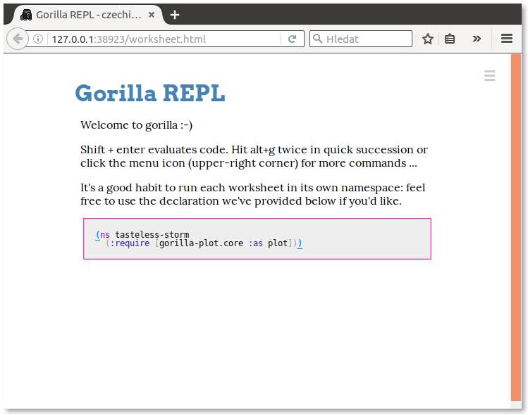

Návod popisuje nastavení operačního systému Ubuntu 16.10 „Yakkety Yak“.

## Cílový stav

Po dokončení všech kroků nastavení bychom měli získat systém, na kterém bude následující software, abychom mohli psát kód v Clojure.

- [Java](https://java.com/): virtuální stroj, nad kterým Clojure běží a je tady absolutní nezbytností.
- [Leiningen](https://leiningen.org/): nástroj pro správu Clojure projektů, který je de facto nezbytností pro jakýkoli vývoj v Clojure. Zároveň instaluje samotný Clojure.
- [Gorilla REPL](http://gorilla-repl.org/index.html): prostředí pro spouštění, experimentování, rychlou zpětnou vazbu a sdílení Clojure kódu.


## Terminál a oprávnění

Při instalaci budeme používat *Terminál*, někdy také označovaný jako příkazová řádka. Jedná se o standardní součást desktopové verze Ubuntu.

Terminál lze například spustit přes *Dash*. Ten se aktivuje klikem na nejvyšší ikonu z levého panelu.


Do Dashe potom stačí napsat několik prvních písmen jako například `term` a jistě se nám Terminál ukáže.


Některé úkony vyžadují vyšší uživatelské oprávnění a je potřeba mít typ účtu správce. Pokud je v systému pouze jeden uživatelský účet, tak se téměř jistě jedná o správce.

Jestli používáme typ účtu správce zjistíme tak, že si otevřeme *Nastavení systému*.


Zde po spuštění vybere z kategorie *Systém* položku *Uživatelské účty*.


Jestli máme správcovský účet nebo ne se potom dozvíme hned pod naším jménem.


Základy práce s terminálem nebo nastavení uživatelských účtů jsou nad rámec této příručky.


## Instalace Javy

Pustíme Terminál (viz. výše) a do něj budeme postupně zadávat následující příkazy.

Nejprve si aktualizujeme seznam dostupných balíčků.

```bash
sudo apt-get update
```

Protože se jedná o operaci vyžadující změnu systémových souborů, musíme zadat naše heslo pro autorizování a potvrzení této změny. Systém si po krátkou dobu bude heslo pamatovat, takže bychom tím už neměli být obtěžováni.

Potom provedeme aktualizaci systému, abychom předešli konfliktům při instalaci Javy a náš systém měl poslední bezpečnostní opravy a jiné aktualizace.

```bash
sudo apt-get upgrade
```

Konečně nainstalujeme samotnou Javu.

```bash
sudo apt-get install default-jdk
```

Nakonec ověříme, že máme Javu nainstalovanou a je dostupná:

```bash
java -version
```

Výsledkem by měl být podobný výpis s tím, že konkrétní čísla verze Javy se mohou mírně lišit zejména u posledních číslic.


## Instalace Leiningenu

Dále budeme pracovat s Terminálem. Pokud ho máte otevřený z instalace Javy, můžete bez problémů pokračovat.

Oproti Javě je Leiningen malý kousek software a o to je situace snazší a přehlednější. Pro instalaci nebudeme používat balíčky z repositářů a nebudeme měnit základní systém.

Nejprve si vytvoříme adresář, kde budeme mít pomocné programy pro programování jako je právě Leiningen:

```bash
mkdir ~/bin
```

Nyní stáhneme skript `lein`, který uložíme do souboru v právě vytvořeném adresáři:

```bash
curl -fsSL https://raw.githubusercontent.com/technomancy/leiningen/stable/bin/lein > ~/bin/lein
```

Poté změníme práva k souboru `lein` tak, aby šel spouštět:

```bash
chmod a+x ~/bin/lein
```

Nakonec instalaci dokončíme spuštěním staženého skriptu:

```bash
lein
```

Leiningen doinstaluje další nutné soubory a následně zobrazí nápovědu, jak se s ním pracuje.


## Vytvoření projektu s Gorilla REPLem

Dále budeme pracovat s Terminálem. Pokud ho máte otevřený z instalace Leiningenu, můžete bez problémů pokračovat.

Prostředí Gorilla REPLu se spouští v rámci projektu, proto takový projekt musíme vytvořit.

Nejprve si ale vytvoříme nový adresář pro vývoj software obecně. V zásadě ale není problém vše provádět přímo v domovském adresáři nebo například ve složce *Dokumenty*. Zde ale budu vytvářet nový adresář *dev* v domovské složce:

```bash
mkdir ~/dev
```

Přesuneme se do vybraného adresáře, kde budeme vytvářet projekt s Gorilla REPLem. V mém případě se jedná o výše vytvořený adresář *dev*.

```bash
cd ~/dev
```

Založíme nový projekt přes Leiningen:

```bash
lein new czechitas-clj
```

Přesuneme se do adresáře s nově vytvořeným projektem:

```bash
cd czechitas-clj
```

Otevřeme si *project.clj* tak, abychom mohli upravit konfiguraci projektu.

```bash
xdg-open project.clj
```

Soubor *project.clj* už je vlastně kód v programovacím jazyce Clojure, proto může působit na první pohled trochu divně a nepřehledně. Je tak potřeba dávat pozor, co děláme.

Nejlepší je najít poslední závorku v souboru. Před ní umístíme kurzor, odřádkujeme `Enterem`, odsadíme dvěma mezerami a vložíme konfiguraci pro Leiningen pluginy s Gorilla REPLem: `:plugins [[lein-gorilla "0.3.6"]]`.


Soubor uložíme a editor zavřeme.

Poté se vrátíme zpět k Terminálu a spustíme Gorilla REPL:

```bash
lein gorilla
```

Začnou se doinstalovávat závislosti a samotný Gorilla REPL. Nakonec se ale spustí a na předposledním řádku bude vypsána adresa, kde běží. Klikneme na ni pravým tlačítkem myší.


Po načtení se nám zobrazí Gorilla REPL.



Skvělé 🙌 Přípravu počítače na workshop máme hotovu! 💪
