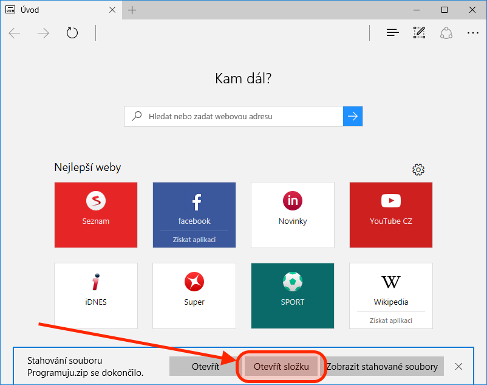
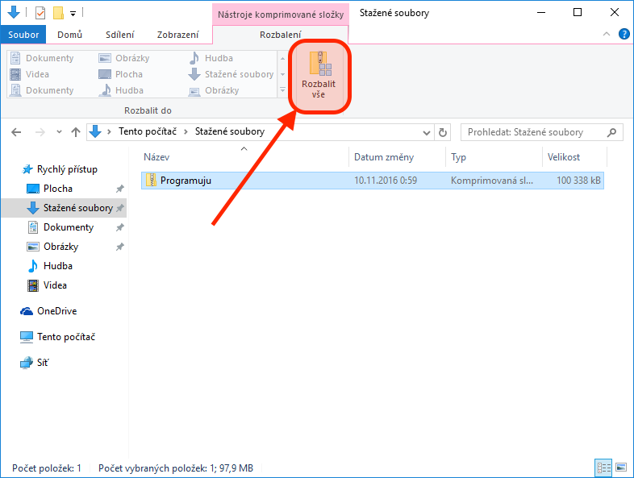
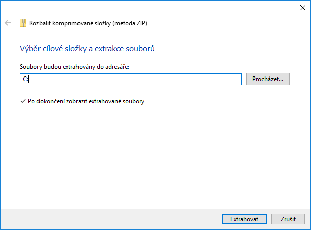
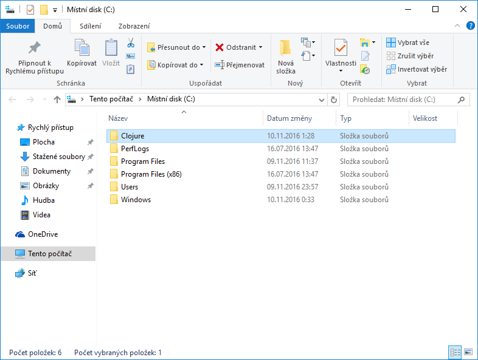
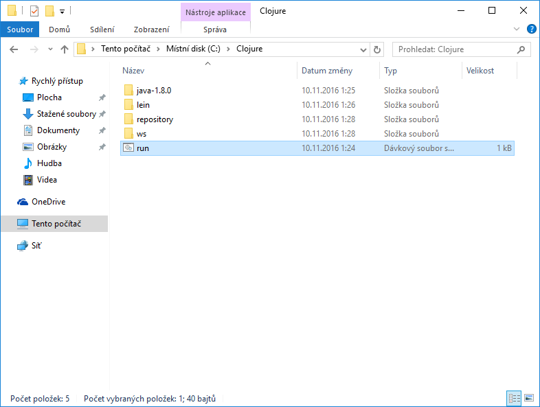
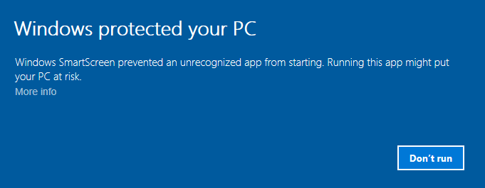
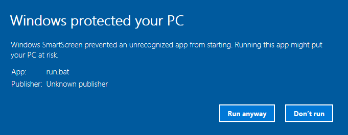
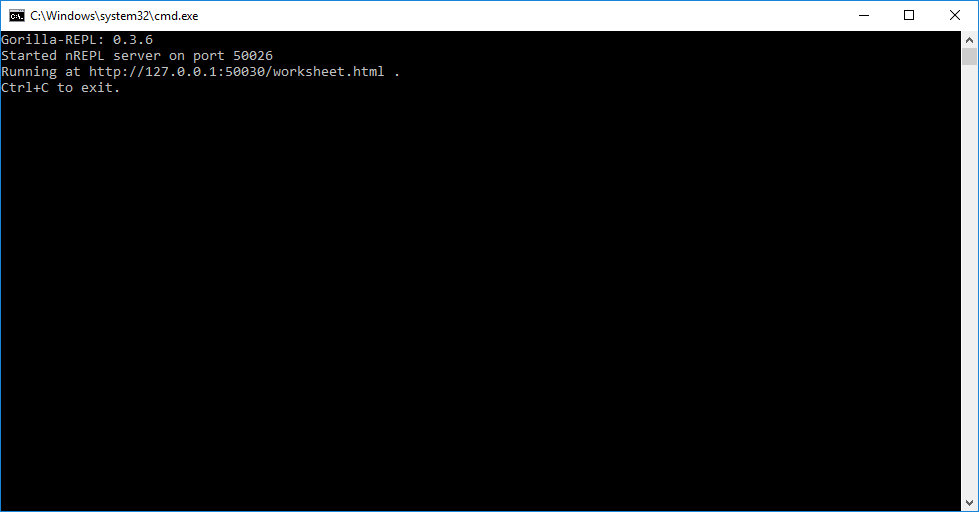
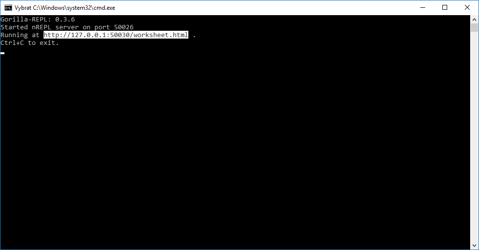
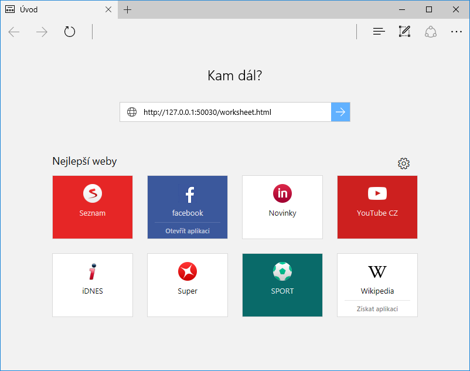

# Nastavení Windows 10

Oproti ostatním operačním systémům máme na Windows výhodu. Skvělá parta z [Prague Lambda Meetup](https://www.meetup.com/Lambda-Meetup-Group/) připravila instalační balík, který vše vyřeší na pár kliknutí.

Začneme tím, že si balík [stáhneme](https://leafclick.com/~katox/Programuju.zip) a otevřeme složku, do které se stáhl.

Soubor ve složce označíme, v liště vybereme sekci *Rozbalení* a v ní akci *Rozbalit vše*.

Jako cestu, do které budou soubory instalovány zadáme `C:`. Volbu pro zobrazení extrahovaných souborů po dokončení necháme vybranou. Akci dokončíme klikem na tlačíko *Extrahovat*.

Přímo na disku *C:* potom vznikne složka *Clojure*, jak můžeme vidět v okně, které se otevřelo po dokončení extrakce.

Složku *Clojure* dvojklikem otevřeme a v ní dalším dvojklikem otevřeme dávkový soubor *run*.

Windows ohlásí, že aplikace může být nebezpečná. Zobrazíme si více informací klikem na *more info*. (Tato a následující obrazovka nejsou přeloženy do češtiny, protože je spouštěna na systému Windows, který byl původně instalován v angličtině. Autor neví, zda je na čistě českých Windows lokalizována.)

V dialogu o ochraně PC se zobrazí informace o tom, že se spouští soubor run.bat (dávkový soubor z instalačního balíku Clojure), který pochází od neznámého vydavatele. Nicméně, pokud nám věříte, klikněte na *Run anyway*.

Otevře se okno příkazové řádky, na kterém nějakou dobu nic neuvidíme. Nakonec se nicméně spustí Gorilla REPL a vypíše o sobě zajímavé informace.

Myší v okně příkazové řádky označíme adresu, na které se Gorilla REPL sputil, a stiskneme klávesy Enter. Tím se nám adresa zkopírovala do schránky.

Otevřeme si internetový prohlížeč, adresu vložíme do adresního pomocí znamého Ctrl+V a přejdeme na ni.

Po načtení se nám zobrazí Gorilla REPL.

Skvělé 🙌 Přípravu počítače na workshop máme hotovu! 💪