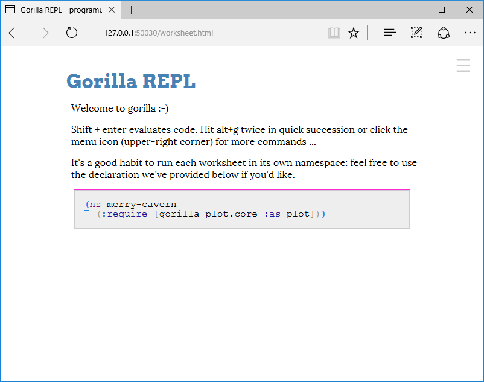

# Nastaven칤 Windows 10

Oproti ostatn칤m opera캜n칤m syst칠m콢m m치me na Windows v칳hodu. Skv캩l치 parta z [Prague Lambda Meetup](https://www.meetup.com/Lambda-Meetup-Group/) p콏ipravila instala캜n칤 bal칤k, kter칳 v코e vy콏e코칤 na p치r kliknut칤.

Za캜neme t칤m, 쬰 si bal칤k [st치hneme](https://leafclick.com/~katox/Programuju.zip) a otev콏eme slo쬶u, do kter칠 se st치hl.

Soubor ve slo쬮e ozna캜칤me, v li코t캩 vybereme sekci *Rozbalen칤* a v n칤 akci *Rozbalit v코e*.

Jako cestu, do kter칠 budou soubory instalov치ny zad치me `C:`. Volbu pro zobrazen칤 extrahovan칳ch soubor콢 po dokon캜en칤 nech치me vybranou. Akci dokon캜칤me klikem na tla캜칤ko *Extrahovat*.

P콏칤mo na disku *C:* potom vznikne slo쬶a *Clojure*, jak m콢쬰me vid캩t v okn캩, kter칠 se otev콏elo po dokon캜en칤 extrakce.

Slo쬶u *Clojure* dvojklikem otev콏eme a v n칤 dal코칤m dvojklikem otev콏eme d치vkov칳 soubor *run*.

Windows ohl치s칤, 쬰 aplikace m콢쬰 b칳t nebezpe캜n치. Zobraz칤me si v칤ce informac칤 klikem na *More info*. (Tato a n치sleduj칤c칤 obrazovka nejsou p콏elo쬰ny do 캜e코tiny, proto쬰 je spou코t캩na na syst칠mu Windows, kter칳 byl p콢vodn캩 instalov치n v angli캜tin캩. Autor nev칤, zda je na 캜ist캩 캜esk칳ch Windows lokalizov치na.)

V dialogu o ochran캩 PC se zobraz칤 informace o tom, 쬰 se spou코t칤 soubor *run.bat* (d치vkov칳 soubor z instala캜n칤ho bal칤ku), kter칳 poch치z칤 od nezn치m칠ho vydavatele. Nicm칠n캩, pokud n치m v캩콏칤te, klikn캩te na *Run anyway*.

Otev콏e se okno p콏칤kazov칠 콏치dky, na kter칠m n캩jakou dobu nic neuvid칤me. Nakonec se ale Gorilla REPL spust칤 a na p콏edposledn칤m 콏치dku bude vyps치na adresa, kde b캩쮂. My코칤 tuto adresu ozna캜칤me a stiskneme kl치vesu `Enter`. T칤m se n치m adresa zkop칤rovala do schr치nky.

Otev콏eme si internetov칳 prohl칤쬰캜, adresu vlo쮂셠e do adresn칤ho 콏치dku pomoc칤 znam칠ho `Ctrl+V` a p콏ejdeme na ni.

Po na캜ten칤 se n치m zobraz칤 Gorilla REPL.

Skv캩l칠 游뗿 P콏칤pravu po캜칤ta캜e na workshop m치me hotovu! 游눩